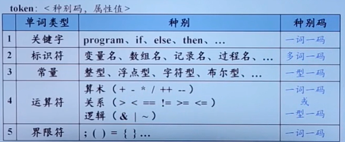
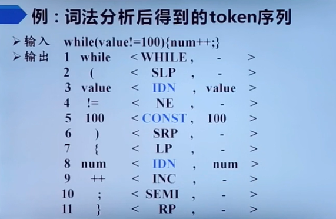
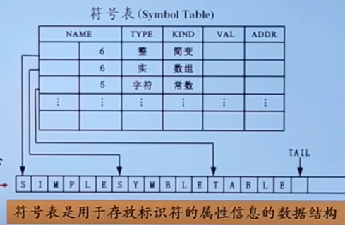
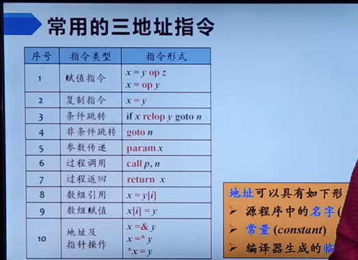
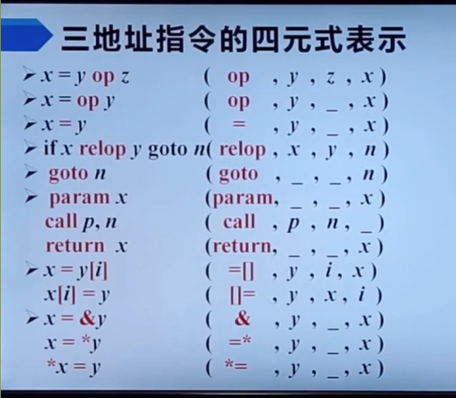

# 编译原理

## 定义
 - 词法分析：分析出单词的词性和词类
 - 语法分析：分析短语，获得句子的结构
 - 语义分析：分析短语在句子中充当什么成分
 
## 过程
````
 -> 词法分析 ->（词法单元流）
 -> 语法分析 ->（语法树）
 -> 语义分析 ->（语法树）
 -> 中间代码
````

## 词法分析
### 词法单元token表

###例：

## 语法分析
### 文法分析
## 语义分析
````
1.种属(Kind)
 - 简单变量，复合变量（数组）...
2.类型(Type)
 - 整型，实型...
3.存储位置，长度
4.值
5.作用域
6.参数和返回值
````
### 符号表

## 中间代码
### 中间代码表现形式
1.三地址码


- 四元式（op, y, z, x）
  

2.语法结构树


## 文法
### 文法的形式化结构
- G(文法) = (Vt, Vn, P, S)
- Vt: 终结符集合，基本符号，token
- Vn: 非终结符
- P: 产生式集合
- S: 开始符号
````
非终极符集合和终结符集合不相交
非终极符集合和终结符集合合为文法字符集
````


